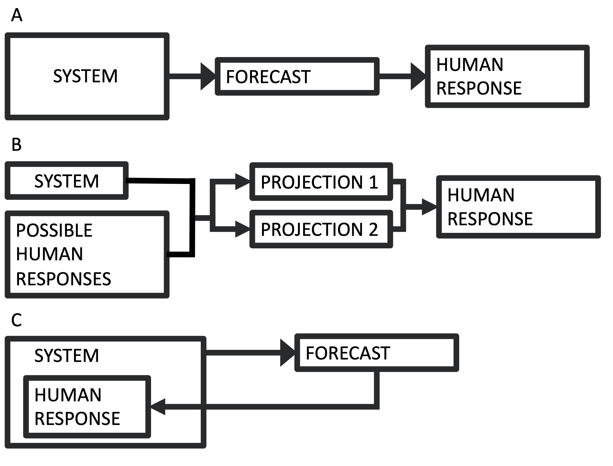

# Introduction {-}

The field of forecasting is growing rapidly to include many systems [@payne2017lessons]. This growth has magnified many ethical considerations around forecast development, such as conflicts of interest, representation of uncertainty, equity for end users, and unintended consequences, to name a few [@hobday2019ethical]. One challenge that is becoming more common is that forecasts increasinly deal with systems that have human components. In conventional forecasts, such as weather forecasts, human responses do not measurably affect the system in question (Fig 1A). There are more and more cases, however, where human actions are coupled to the system dynamics. Examples include forecasts used in living resource management [@tommasi2017managing], endangered species management [@pendleton2012weekly], and epidemic forecasts [@adam2020special]. Historically, cases like these have often been framed as projections, which present scenarios that are contingent upon different human choices (Fig 1B). 

In contrast to projections, forecasts provide specific predictions about future events. If humans are changing their behavior in response to information in the forecast, then the forecast is no longer outside of the system, but is instead a dynamically connected component of the system (Fig 1C). This phenomenon, sometimes refered to as "forecast feedback," has been considered to some degree in economic and political forecasting [@galatin1976optimal], but is rarely considered in biological systems. According to the "Law of Forecast Feedback", this type of dynamic can hypothetically produce a recursion paradox, where predictability breaks down entirely [@smith1964law]. As forecasts are increasingly used within the systems they are forecasting, we need to examine the effects that forecast predictions can have on the dynamics of the system in question.

Epidemic models represent a case where forecasts and human behavior can be very tightly coupled. A forecast predicting a high infection peak can motivate measures like quarantine or social distancing. These measures change the forecasted dynamics, ideally lowering the predicted peak. A less severe outlook can then motivate an easing of measures, which in turn can raise the peak again. This two-way feedback illustrates the difficulty in forecasting systems coupled to human dynamics.

Epidemic models are conventionally used for projections, rather than for forecasts. They can estimate the consequences of certain actions, potential dangers, or scenarios. However, in the modern information-rich environment, there is a demand for real-time forecasts for both management and general audiences, and such forecasts of epidemics are increasingly common. Many of the modeling studies that have responded to the COVID-19 outbreak are forecasts [@covid2020forecasting; @roosa2020real; @fanelli2020analysis]. The United States Center for Disease Control has even issued an open call for COVID-19 forecasts through a forecasting challenge (https://github.com/cdcepi/COVID-19-ILI-forecasting). This raises the question: what is the effect of a forecast on the epidemic dynamics? In most biological forecasts, this feedback is not explicitly taken into account. 

We examined this question using the standard susceptible-infected-removed (SIR) epidemic model. The SIR framework underlies many projections and forecasts that form the basis for response strategies [@adam2020special]. We built forecast feedback into the SIR model by allowing the contact rate to change dynamically in response to different information provided by the SIR equations. In turn, the SIR model dynamics depend on the contact rate, so that there is two-way feedback between the forecast and the other system dynamics. The purpose here is not to fully analyze or characterize the global properties of a particular dynamical model, as there is a whole class of well characterized versions of the SIR model [@beretta1995global;@anderson1979population;@takeuchi2000global;@satsuma2004extending;@kyrychko2005global;@batista2020estimation] that one could modify to explore these feedbacks. Rather, we use simulations of a few simple SIR modifications to illustrate important implications of these feedbacks. Examining a system in this way provides a critical analysis of the role of a forecast in a rapidly changing, coupled human system. 

```{r, echo=F, fig.width = 5, fig.height = 4, out.width = "350px", fig.align = "center", fig.cap="(A) The conventional forecasting scheme, where a system informs a forecast, which informs some human response. (B) The conventional scheme for projection, where a range of possible actions produce multiple scenarios (i.e. projections), which can inform action. (C) The forecasting scheme where the human response is part of the system dynamics."}

```

# Methods {-}

Our objective is to test the potential effects of an epidemic forecast on the epidemic itself. The approach is to explore this question in its simplest form. To that end, we use the standard susceptible-infected-removed (SIR) model:
$$
\begin{aligned}
\frac{dS}{dT} &= -\alpha SI \\
\frac{dI}{dt} &= \alpha SI - \beta I \\
\frac{dR}{dt} &= \beta I
\end{aligned}
$$
Here, $S$ is the number of individuals in a population that are susceptible to infection, $I$ is the number of infected individuals, and $R$ is the number of removed individuals (interpreted as recovered/immune, dead, or some combination); $\alpha$ is the contact rate, and $\beta$ is the removal rate. We use the model in non-dimensionalized form to show general results, rather than those specific to a particular outbreak (Parameter values: $\alpha_*=1$,$\alpha_0=0.2$, $\beta=0.1$; Initial conditions: $S=0.999$, $I=0.001$, $R=0$, $\alpha=1$). The SIR model has been one of the primary tools for making epidemic, social distancing, and shelter in place measures. There are many ways to modify this system of equations to better approximate a particular epidemic. Our interest is in the general effect that model output (either current or forecasted) can have on the dynamics themselvs, as mediated through changes in human behavior. The contact rate $\alpha$ is what would likely change with the suggested response measures. A high infection or a severe enough forecast are what motivates measures whose aim is to reduce the contact rate. We therefore test the effect of allowing $\alpha$ to vary as a function of the SIR model output.

Our examination of this system asks two general questions:

(1) What if adoption of response measures depends on the current level of infection? This simulates the scenario where the human response is different depending on whether the level of infection is low or high. In this case, $\alpha$ depends on $I$ at any given time.

(2) What if adoption of response measures depends on the forecasted peak infection? Peak infection is a primary concern with major epidemics because of health care capacity. In this case, $\alpha$ depends on the predicted peak infection $I_*$, with the prediction made at any given time using a standard SIR solution.

Beginning with case (1), $\alpha$ is a dynamic function, dependent on $I$. We add the following fourth equation to our dynamical system:
$$\frac{d\alpha}{dt} = r\alpha(1-\alpha / K)$$
where
$$K(I) = \frac{\alpha_0 - \alpha_*}{N^2}I^2 + \alpha_*$$
is the contact rate assymptote that $\frac{d\alpha}{dt}$ approaches. The two parameters $\alpha_*$ and $\alpha_0$ are respectively the unhindered contact rate, and the reduced contact rate after response measures are in full effect. This gives a declining curve in assymptotic contact rate $K$ as a function of the infection level $I$ (Fig 2A). The total population size is $N=1$ in the non-dimensionalized case. Finally, we have the parameter $r$, which determines how quickly people adopt response measures--i.e. how quickly they move from one $\alpha$ to another. It is likely that from an empirical point of view, $r$ could have a wide range of values, depending on the community and other contextual information. There are other possibilities for the shape of this curve and for the $\alpha$ equation, with different functional forms and producing a wide range of possible dynamics. The quadratic gives a simple curve where the response gets more intense as infections get higher, which allows us to simulate some simple but realistic properties. As a diagnostic, we use $I_{max}$, the magnitude of the peak infection as the dynamics play out, because of its relevance to health care capacity, as in the COVID-19 pandemic.

Question (2) requires having a forecast. For this, we use an analytical solution for the infection peak of the SIR model, 
$$I_*=\left[1-\frac{\beta}{\alpha N} - \frac{\beta}{\alpha N}\log \frac{\alpha N}{\beta} \right] N$$
where $I_*(t)$ is the predicted maximum $I$ value--i.e. a forecast of the magnitude of the infection peak, where the forecast is made at any time, $t$. Here, we suppose that people are reacting to the forecasted peak, rather than the current level of infection, and that the forecast is based on current information at any given time. The forecast solves the standard SIR model, using the current parameter values, as a forecaster would do in real time. This is modeled by replacing $I$ with $I_*$ in the equation for $K$. Again, we use $I_{max}$ as a diagnostic.

The objective here is to illustrate potential dynamics of the feedback between forecast output and human behavior, rather than to ananlyze the global properties of this particular formulation. To this end, we step through simulations where we adjust the human response rate parameter $r$ and compare the diagnostic $I_{max}$. Additionally, the forecasted $I_*$ value at any time represents a hypothetical, because the population is constantly responding, and so the forecast is changing. Moreover, as with any forecast, there is the potential that the prediction is an over- or under-estimation of what will happen, due to stochasticity and other forms of uncertainty. Forecast error can potentially affect forecast feedback dynamics. We tested this effect by scaling the forecasted $I_*$ value proportionally, from 0.4 to 1.6, and looking at the effect on the infection peak $I_{max}$ across a range of $r$ values.

# Results {-}

We can now evaluate question (1) by looking at how $I_{max}$ depends on $r$ (Fig 2B). Responding to the current level of infection leads to a drop in the infection peak (~8% using this set of parameters), as compared to no response, if the response rate is sufficiently fast. If the response rate is very slow, there is effectively no reduction in the infection peak. There is a sharp transition between these two cases. In this example, a response rate slower than about $r = 0.1$ -- corresponding to a response time of about 10 time units -- makes no notable change in the infection peak. For different parameter values, the threshold levels can be different, but the basic shape of these relationships is consistent across different parameterizations.

```{r eval=TRUE, echo=FALSE, fig.height = 3.5, fig.width = 5.5, out.width = "100%", fig.align = "center", fig.cap="(A) The dependence of the assymptotic contact rate (K) on the population size (I). (B) The dependence of the infection peak magnitutde on the rate (r) at which the population reduces the contact rate (i.e. adopts response measures). The population responding to current infection levels (black); the population responding to forecasted infection peaks (grey)."}
par(mfrow=c(1,2)) 

e <- 2
alphaS <- 0.05
alpha0 <- 0.005
N <- 1000
I <- seq(0,1000)
K <- (alpha0-alphaS)/(N^e)*(I^e)+alphaS
plot(I,K,type='l',lwd = 5,
     yaxt="n",
     xaxt="n",
     ylim=c(0,alphaS*1.1),
     main="A",
     xlab = "Infected population (I)",
     ylab = "Assymptotic contact rate (K)")
axis(2,at=c(alpha0,alphaS),
     labels=c(expression(alpha[0]),expression(alpha['*'])))
axis(1,at=c(0,1000),
     labels=c(0,expression(N)))

source('SIRfunctions.R')
time_values <- seq(0, 50, by = 0.1) # days
RT <- 10^seq(-3,3,by = 0.25) # range of r values
Imax <- RT*NA

# Parameters
bet = 0.1    # recovery rate (/day)
#r = R[idx], # human response rate
alphaS = 01 # fastest infections contact rate (/person/day)
alpha0 = 0.2  
S = .999  # number of susceptibles at time = 0
I = .001  # number of infectious at time = 0
R =   0   # number of recovered (and immune) at time = 0
alpha = 01  #initial alpha (should be high, or = alphaS)

for (idx in 1:length(RT))
{
  sir_values_1 <- SIRalpha(bet=bet,r=RT[idx],alphaS=alphaS,alpha0=alpha0,
                           S=S,I=I,R=R,alpha=alpha,
                           time_values = time_values)
  Imax[idx] <- max(sir_values_1$I)
}

plot(RT,Imax,log='x',type='l',lwd=5,
     xlab = 'Response rate (r) (1/unit time)',
     ylab = 'Peak infections (proportion)',
     ylim = c(.580,.680),
     main = "B")


time_values <- seq(0, 50, by = 0.1) # days
RT <- 10^seq(-3,3,by = 0.25) # range of r values
Imax <- RT*NA

# Parameters
bet = 0.1    # recovery rate (/day)
#r = R[idx], # human response rate
alphaS = 01 # fastest infections contact rate (/person/day)
alpha0 = 0.2  
S = .999  # number of susceptibles at time = 0
I =   .001  # number of infectious at time = 0
R =   0   # number of recovered (and immune) at time = 0
alpha = 01  #initial alpha (should be high, or = alphaS)

for (idx in 1:length(RT))
{
  sir_values_1 <- SIRalphaS(bet=bet,r=RT[idx],alphaS=alphaS,alpha0=alpha0,
                           S=S,I=I,R=R,alpha=alpha,
                           time_values = time_values)
  Imax[idx] <- max(sir_values_1$I)
}

lines(RT,Imax,col="grey",lwd=5,#log='x',
     xlab = 'Rate (r) of response (1/unit time)',
     ylab = 'Peak infections (proportion)')
```

When the contact rate is responsive to the forecasted infection peak rather than to the instantaneous infection level (question 2), the shape of the curve is similar (Fig 2B). The reduction in the peak infection is larger, (a ~12% drop using this set of parameters, or roughly a 50% improvement over the former case). There is also a notable difference in the needed response time. In this case, a response time of 10 time units ($r=0.1$) is sufficient for most of the drop to occur. Across parameter space, the magnitudes of these differences change, but the pattern is consistent.

We tested the effects of an over- or under-estimate forecast (Fig 3), with the forecasted value $I_*$ scaled proportionally in the range 0.4 to 1.6. If the forecast is an overestimate, and if the response rate is fast enough, an inaccurate forecast can lower the peak even more than an accurate forecast. An overestimated forecast also gives a larger window of time for response -- i.e. the response rate does not need to be as fast to see a lowering of the peak. If the forecast is an underestimate, however, it leads to a higher peak and narrows the response time window. Finally, if the response rate is very slow, inaccuracies in the forecast in either direction make very little difference. In all of these cases, responding to a forecast is better than not responding at all, due to how we have formulated $K(I)$ as a decreasing function of $I$.

```{r eval=T, echo=F, fig.height = 4, fig.width = 4, fig.align = "center", fig.cap="The dependence of the infection peak levels (contours) on the rate (r) at which the population reduces the contact rate (e.g. adopts social distancing behaviors) and the accuracy of the forecast. In this simulation, the population is responding to forecasted peak infection levels."}
library(deSolve)
time_values <- seq(0, 50, by = 0.1) # days
R <- 10^seq(-3,3,by = 0.25)
RX <- seq(0.4,1.6,by=0.05)
Imax <- matrix(NA,nrow = length(R), ncol = length(RX))
for (idx in 1:length(R))
{
  for (jdx in 1:length(RX))
  {
    rx <- RX[jdx]
    sir_equations <- function(time, variables, parameters) {
      with(as.list(c(variables, parameters)), {
        dS <- -alpha * I * S
        dI <-  alpha * I * S - bet * I
        dR <-  bet * I
        dalpha <- r * alpha * 
          (1 - (alpha / (( ((rx*(S+I+R)*(1-(bet/alpha/(S+I+R))-(bet/alpha/(S+I+R))*log(alpha*(S+I+R)/bet)))^2)*(alpha0-alphaS)/((S+I+R)^2)+alphaS ))))
        return(list(c(dS, dI, dR, dalpha)))
      })
    }
    parameters_values <- c(
      #alpha  = 0.004, # infectious contact rate (/person/day)
      bet = 0.1,    # recovery rate (/day)
      r = R[idx], # human response rate
      alphaS = 1, # fastest infections contact rate (/person/day)
      alpha0 = .2  # improved rate
    )
    initial_values <- c(
      S = .999,  # number of susceptibles at time = 0
      I =   .001,  # number of infectious at time = 0
      R =   0,   # number of recovered (and immune) at time = 0
      alpha = 1  #initial alpha (should be high, or = alphaS)
    )
    sir_values_1 <- ode(
      y = initial_values,
      times = time_values,
      func = sir_equations,
      parms = parameters_values 
    )
    sir_values_1 <- as.data.frame(sir_values_1)
    Imax[idx,jdx] <- max(sir_values_1$I)
  }
}
contour(log(R),RX,Imax,
        xlab='Response rate (log day-1)',
        ylab='Forecast inaccuracy (proportional)',
        nlevels = 10)
```


# Discussion {-}


Many new forecasting products are coming online. With the COVID-19 pandemic in particular, studies and online tools with real-time or near-real-time preditions and projections are produced and available rapidly [@biswas2020space; @batista2020estimation; @chen2020time; @simha2020simple; @teles2020predicting]. People are generally not accustomed to interpreting forecasts as being dynamically linked with their own behavioural responses to the forecast, but such cases are more and more common, and include epidemics, climate change, and endangered species management, to name a few.

One growing challenge is the blurring lines between forecasts and projections. For COVID-19, early warnings of a potential global pandemic did not motivate early responses in many places, allowing the virus to move from a local to a global problem. In places like the U.S. and U.K., significant action at the national level did not take place until after Imperial College released projections that millions would die in the absence of social distancing [@adam2020special], and after signs of the epidemic were widespread. Once actions were taken, the true trajectory began to deviate from the worst case scenarios, and the projections no longer matched reality. This is typical of projections, which aren't intended to be specific predictions, but rather play out different scenarios that depend on initial actions. Climate projections are similar, calculating future conditions based on representative concentration pathways (RCPs) [@taylor2012overview]. The RCPs each depict a scenario of future carbon such as aggressive emission reductions (RCP2.6) or business as usual (RCP8.5). There is no weighting placed on which pathway society is likely to select. The goal of the projections is to evaluate the consequences of actions and to contrast action with inaction. 

Forecasts, on the other hand, do represent specific predictions. We are more accustomed to weather forecasts, where human responses do not change the outcome. Many epidemic models are now offering forecasts [e.g. @covid2020forecasting; @roosa2020real; @fanelli2020analysis], and in systems like these, humans are a dynamic component, responding to ongoing changes. The human actions depend on the state of the system and the information in forecasts. In reality, not all scenarios are equally available -- the likelihood that humans will act depends on the state of the system and the information in forecasts. Examining this dynamic within an SIR model framework illustrates some significant points. 

First, unsurprisingly, using information from a forecast can improve the outcome. Additionally, using the forecast also grows the window of time in which a response has an effect. This could give more room to allow for missteps during times when uncertainty is high. Second, inaccuracies in the forecast have an asymmetrical effect on the outcome. An overestimate in the forecast can improve the outcome, in this case lowering the infection peak, but an underestimate in the forecast can actually make things worse. By underestimating the potential danger, response is diminished. This raises the difficult ethical question of whether it is better to give an accurate forecast if a more dire forecast could actually motivate a stronger response. This question becomes even more complex if the forecast is one member in an ensemble that is used for decision making. Finally, if the response rate is too slow, a forecast makes very little difference, but an over-estimate forecast can buy more response time.

We have to be cautious of using forecasts that do not take into account the effects of the forecast feedback on the system dynamics. This is especially true in systems where human health depends on the forecast, as is the case with SIR and other epidemic models. The examples shown here are represent just one possible formulation for this type of dynamic. There is a whole class of models with this type of modification to examine -- nearly any dynamical model where human decision making plays an ongoing role -- producing a wide range of model behaviors. Forecast feedback creates certain challenges and limitations for predictions, possibly paradoxical, but at a minimum we should try to understand the effects this feedback can have on the systems we are trying to predict.


# References
\setlength{\parindent}{-0.2in}
\setlength{\leftskip}{0.2in}
\setlength{\parskip}{8pt}
\noindent